# TODOS
- TODO limit CIDR blocks to private ones

This repository represents a template for starting a terraform based project in **Azure**.
You should copy this template and use it as a basline for your project

**If you would like to include anything to the template or find something missing, please feel free to contribute by opening a pull request or reach out to <jnavratil@deloittece.com>**

This template has baked in:

* Example Terraform code
  * Also demonstrating use of shared DTT modules (URL)
* CI/CD pipelines for terraform
  * Also demonstating use of shared DTT pipeline templates (URL)
* CI scripts for managing TF state and injecting variables
* Example Variables/secrets management
* Integrations with additional CI tools built around terraform
  * Renovate -> Automatic tracking of terraform provider versions and auto PR to propose version upgrades <https://github.com/renovatebot/renovate>
  * terraform-docs -> Automatic terraform documentation generation <https://github.com/terraform-docs/terraform-docs>
  * checkov -> SAST of Terraform code <https://github.com/bridgecrewio/checkov>
  * tflint -> linting Terraform code <https://github.com/terraform-linters/tflint>
  * driftcl -> Drift detection tool for terraform <https://github.com/snyk/driftctl>
  * infracost -> Automatic assesment of cloud costs based on TF code <https://github.com/infracost/infracost>
  * pike -> Automatic determination of needed execution permissions for TF <https://github.com/JamesWoolfenden/pike>
  * terraform-compliance -> compliance checks and rules <https://learn.microsoft.com/en-us/azure/developer/terraform/best-practices-compliance-testing>

[[_TOC_]]

# Step by step guide on how to copy and setup project from template
For a complete step by step guide on initial setup follow here https://dev.azure.com/Deloitte-CE-IT/CE-CZ-CNS-CLOUD-REFERENCES/_wiki/wikis/CE-CZ-CNS-CLOUD-REFERENCES.wiki/4754/Step-by-step-guide-for-using-AWS-project-template

Below sections are about explanation of the templates and their structure
# Terraform file structure

The below file structure represents the base of the your project.

```
.
├── README.md
├── TFDOCS.md
├── backend.tf
├── infracost-base.json
├── locals.tf
├── main.tf
├── db.tf
├── iam.tf
├── modules
│   └── my-custom-module
│       ├── TFDOCS.md
│       ├── main.tf
│       ├── output.tf
│       └── variables.tf
├── output.tf
├── provider.tf
├── renovate
│   └── config.js
├── renovate.json
├── secrets.tf
├── renovatebot-pipelines.yaml
├── scripts
│   ├── ensure-state-az.sh
│   └── terraform-docs-update.sh
├── terraform-pipelines.yaml
├── tests
│   └── website.tftest.hcl
├── variables
│   ├── dev.tfvars
│   └── prod.tfvars
└── variables.tf
```

Now.. that's a lot of files, so let's go through them and explain their purpose.

## .tf files

The minimal file structure for terraform recommended by hashicorp is this

```
.
├── README.md
├── main.tf
├── variables.tf
├── outputs.tf
```

In this setup:

* main.tf defines all the Terraform resources, providers, locals and everything together

* variables.tf define all the variables that the resources will take in

* outputs.tf define all the outputs that will be displayed after terraform plan or apply

We are expanding on this structure a bit to make it more seperate and clear:

* provider.tf defines all providers and their versions (e.g terraform version, azurerm version etc.), here you will find all the versions of providers

* locals.tf stores all locals, in this example its holding tag values and infix, which is reused across all resources created

## Remote state

* backend.tf stores remote state details. This file is auto generated by ./scripts/ensure-state-az.sh . Terraform looks at this file during initialization, when it decides which state file to use. More details in <https://developer.hashicorp.com/terraform/language/settings/backends/remote>

### ./scripts/ensure-state-az.sh

This script is responsible for ensuring a remote state is made and available before running terraform init command

Execution flow:

* it takes AWS_SECRET_ACCESS_KEY, ARM_CLIENT_ID, ARM_TENANT_ID and ARM_SUBSCRIPTION_ID environmental variables
  * these are defined in [link](#variable-groups-with-secrets)

* it logs in as service principal with above variables

* it will create resource group, storage account and **blob** container with key terraform.tfstate, this is where terraform state is stored
  * If these resources already exists, just skip the steps

* Logout from azure

For more details, check  out the source bash script, there are comments on it ;)

## why db.tf, iam.tf and so on for services ?

In a small project its fine to put all resources inside a main.tf file. However as the project grows it makes more sense to seperate the resources out. For example store IAM related resources like users, roles etc. in iam.tf or store all your databases in db.tf etc.

## And what about .tfvars ?

You might have noticed we have tfvars

```
├── variables
│   ├── dev.tfvars
│   └── prod.tfvars
```

What are tfvars ? tfvars are input variables.

We have the variables.tf file, which just defines which variables are needed for resources and optionally their **default** values. However the actual values are defined either as CLI arguments, environmental variables or **as part of .tfvars file** <https://developer.hashicorp.com/terraform/language/values/variables>

It is basically a configuration file with variables and we have **one .tfvars file per environment** (dev.tfvars, uat.tfvars, prod.tfvars etc.)

The structure is in form of key value pairs like so

```terraform
location="westeurope"
environment="dev"
project_name="genaipoc"
```

The plain text values are always **NON-SECRET** this is important, remember this file cannot contain **ANY SECRETS** since its version controlled

# Secrets management

Secrets should always stay out of .tfvars. Our preferred way of handling secrets in Terraform is a data reference to secret store provided by the cloud, in Azure example that is KeyVault.

Alternative is defining secret variables in variable groups and then importing them as environmental variables, this works fine usually for simple secrets for other tasks in the pipeline, but generally for Terraform referencing the external data soure is easier

## KeyVault setup in Terraform

1. create keyvault manually in Azure, each environment (dev, uat, prod etc.) should have a seperate one
2. create some secret in it, our example is postgres-pass

3. create a data reference to the keyvault in secrets.tf

```HCL
data "azurerm_key_vault" "tf-secrets" {
  name                = "vault-${local.infix}"
  resource_group_name = azurerm_resource_group.main-not-used-demo.name
}
```

4. create data reference to the keyvault secret

```HCL
data "azurerm_key_vault_secret" "postgres_pass" {
  name         = "postgres_pass"
  key_vault_id = "${data.azurerm_key_vault.keyvault.id}"
}
```

do this for any other secret that you add manually, the resulting secrets.tf may then look like this

```HCL
data "azurerm_key_vault" "tf-secrets" {
  name                = "vault-${local.infix}"
  resource_group_name = azurerm_resource_group.main-not-used-demo.name
}

data "azurerm_key_vault_secret" "postgres_pass" {
  name         = "postgres_pass"
  key_vault_id = "${data.azurerm_key_vault.tf-secrets.id}"
}

data "azurerm_key_vault_secret" "another_pass" {
  name         = "postgres_pass"
  key_vault_id = "${data.azurerm_key_vault.tf-secrets.id}"
}

data "azurerm_key_vault_secret" "some_another_pass" {
  name         = "postgres_pass"
  key_vault_id = "${data.azurerm_key_vault.tf-secrets.id}"
}

```

5. if you want to reference the secret use the usual data reference syntax, here is an example with the postgres_pass in db.tf

```HCL
  administrator_login    = var.postgres_user
  administrator_password = data.azurerm_key_vault_secret.postgres_pass.value
```

Thats it, now you reference a secret from keyvault :)

# Terraform Testing

You can see that we have a dummy file in

```
├── tests
│   └── website.tftest.hcl
```

This is just a placeholder for something that's coming. From Terraform version 1.6 they introduced a Terraform testing framework <https://developer.hashicorp.com/terraform/language/tests>

Currently its not mature enough for simple integration and use, but in the future it would be great to integrate it

# CI/CD Description and Terraform tools

* When you click on the 'Pipelines' section in Azure DevOps, you may see 2 fairly similiar features. "Pipelines" and "Releases", the main difference is that "Pipelines" service is defined in code as YAML and Releases defined in GUI. In the past "Pipelines" were only for CI and "Releases" were only for CD. However now the recommended way is to write everything in Azure pipelines as YAML, they support **all** the features that Releases for CD and allow for GIT versioning, template reuse, more cohesive workflow etc.

* If you are not familiar with Azure DevOps pipelines, I would advise to read the docs a bit, just so you understand what are stages, jobs, tasks, varaibles, artifacts etc. good place to start is here <https://learn.microsoft.com/en-us/azure/devops/pipelines/get-started/key-pipelines-concepts?view=azure-devops>
* Also check out how variable scopes and types works if you plan to write your own pipelines, it will save you a lot of grey hair if you understand how it works from the start <https://learn.microsoft.com/en-us/azure/devops/pipelines/process/variables?view=azure-devops&tabs=yaml%2Cbatch>

## Introdutction to Azure DevOps variable groups for storing variables for use within pipeline

For other variables not directly related to Terraform like for tokens for the tf tools etc. we can define them in regular variable groups

Lets first step through variable groups in Azure DevOps, these are located under the **library** section in azure devops
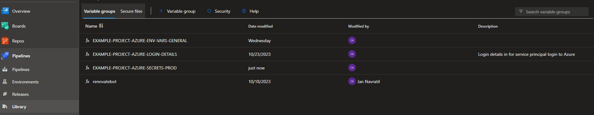

lets check the AZURE-ENV-VARS-GENERAL variable group, as you can see it consists of key-value pairs.
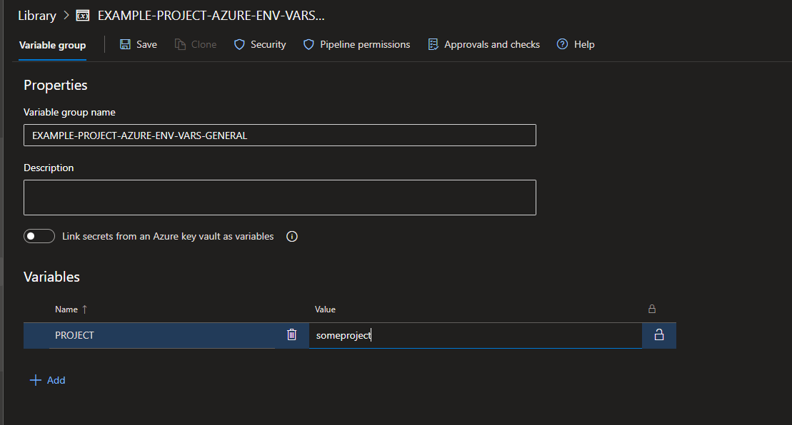

If its a secret value you click on the lock in the right, the value will become invisible and you can't open it anymore later
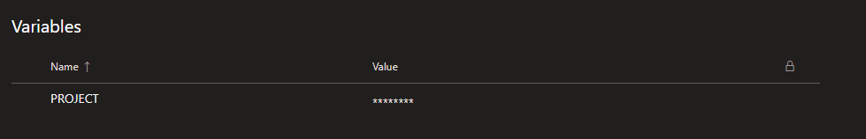

We can use these variable groups at our CI pipelines. If you will check terraform-pipelines.yaml you can see that we are importing 2 variable groups at root level

```yaml
variables:
- group: EXAMPLE-PROJECT-AZURE-ENV-VARS-GENERAL
- group: EXAMPLE-PROJECT-AZURE-LOGIN-DETAILS
```

The key value pairs defined in the variable groups now become available as envrionmental variables in the pipeline

be careful that if you want to make use of secret envrionmental variables in scripts, you need to explicitly define this in the env block to whitelist. This is a secuirty preventive measure from ADO to not make secrets available to scripts by default

```YAML
env:
  SOMESECRET: $(SOMESECRET)
```

Note that all print statements etc. are fortunately vommited as *** if you get the bad idea to print out a secret variable :D

## Azure DevOps pipeline templates

-

* YAML pipelines tend to be quite expressive and there is a usually quite a bit of boilerplate, if you have multiple stages, it's possible that code is going to be duplicated many times. The same goes for multiple projects, all TF pipelines will look roughly the same, at the end of the day (if we discount additional tooling around it).. we need to init,plan and apply ;)
* For this reason Azure DevOps pipelines have 'templates' feature which allows reuse of code. You can define a template for a task, job or a whole stage and you can reuse this template in the pipeline, across pipelines or even across projects
* Let's look at this bare pipeline example, it's not necessary for you to understand it for now

```YAML
trigger:
- main

variables:
- group: GENAI-POC-AZURE-ENV-VARS-GENERAL
- group: GENAI-POC-AZURE-LOGIN-DETAILS


stages:
- stage: TF_Plan
  variables:
  - group: GENAI-POC-AZURE-SECRETS-PROD
  jobs:
  - job: terraform_plan
    pool:
      name: Azure Pipelines
      vmImage: 'ubuntu-latest'

    steps:
    - task: Bash@3
      displayName: 'Initialize Project'
      inputs:
        targetType: filePath
        filePath: './scripts/ensure-state-az.sh'
      env:
        AWS_SECRET_ACCESS_KEY: $(AWS_SECRET_ACCESS_KEY) 


    - task: TerraformInstaller@0
      displayName: 'Use Terraform 1.6.1'
      inputs:
        terraformVersion: 1.6.1
      env:
        AWS_SECRET_ACCESS_KEY: $(AWS_SECRET_ACCESS_KEY) 

    - task: TerraformCLI@0
      displayName: 'Terraform Init'
      inputs:
        command: init
        commandOptions: '-reconfigure'
        backendType: azure
      env:
        AWS_SECRET_ACCESS_KEY: $(AWS_SECRET_ACCESS_KEY) 

    - task: TerraformCLI@0
      displayName: 'Terraform Validate'
      inputs:
        command: validate
      env:
        AWS_SECRET_ACCESS_KEY: $(AWS_SECRET_ACCESS_KEY) 


    - script: mkdir tfplans
      displayName: Create tfplans directory  

    - task: TerraformCLI@0
      displayName: 'terraform plan'
      inputs:
        command: plan
        publishPlanResults: 'TF Plan'
        commandOptions: '-var-file $(System.DefaultWorkingDirectory)/variables/$(ENVIRONMENT).tfvars -out=$(System.DefaultWorkingDirectory)/tfplans/terraform.tfplan -detailed-exitcode'

      env:
        AWS_SECRET_ACCESS_KEY: $(AWS_SECRET_ACCESS_KEY) 

    - task: CopyFiles@2
      displayName: 'Store Terraform plan as an artifact'
      inputs:
        contents: '$(System.DefaultWorkingDirectory)/tfplans/**'
        targetFolder: '$(Build.ArtifactStagingDirectory)'

    - publish: '$(Build.ArtifactStagingDirectory)/tfplans'
      displayName: 'Publish powershell scripts for later use'
      artifact: tfplans 

  # - job: wait_for_validation
  #   displayName: 'PLEASE CHECK THE TERRAFORM PLAN CONTAINS DESIRED RESULTS WE WANT TO APPLY'
  #   dependsOn: terraform_plan
  #   pool: server 
  #   timeoutInMinutes: 4320 # job times out in 3 days
  #   steps:   
  #   - task: ManualValidation@0
  #     timeoutInMinutes: 1440 # task times out in 1 day
  #     inputs:
  #       notifyUsers: |
  #         test@test.com
  #         example@example.com
  #       instructions: 'PLEASE CHECK THE TERRAFORM PLAN CONTAINS DESIRED RESULTS WE WANT TO APPLY AND ALSO CHECK SAST AND LINTING RESULTS BEFORE Approving'
  #       onTimeout: 'reject'

  - deployment:  TF_Plan
    displayName: terraform_apply
    pool:
      name: Azure Pipelines
      vmImage: 'ubuntu-latest'
    # dependsOn: wait_for_validation
    dependsOn: TF_Plan
    environment: '$(ENVIRONMENT)'
    strategy: 
      runOnce:
        deploy:
          steps:
          - task: Bash@3
            displayName: 'Initialize Project'
            inputs:
              targetType: filePath
              filePath: './scripts/ensure-state-az.sh'
            env:
              AWS_SECRET_ACCESS_KEY: $(AWS_SECRET_ACCESS_KEY) 


          - task: TerraformInstaller@0
            displayName: 'Use Terraform 1.6.1'
            inputs:
              terraformVersion: 1.6.1
            env:
              AWS_SECRET_ACCESS_KEY: $(AWS_SECRET_ACCESS_KEY) 

          - task: TerraformCLI@0
            displayName: 'Terraform Init'
            inputs:
              command: init
              commandOptions: '-reconfigure'
              backendType: azure
            env:
              AWS_SECRET_ACCESS_KEY: $(AWS_SECRET_ACCESS_KEY) 

          - task: TerraformCLI@0
            displayName: 'Terraform Validate'
            inputs:
              command: validate
            env:
              AWS_SECRET_ACCESS_KEY: $(AWS_SECRET_ACCESS_KEY)
          - task: TerraformCLI@0
            displayName: 'terraform apply'
            inputs:
              command: apply
              commandOptions: '-auto-approve $(Pipeline.Workspace)/tfplans/terraform.tfplan'
            env:
              AWS_SECRET_ACCESS_KEY: $(AWS_SECRET_ACCESS_KEY) 

  - job: terraform_linting
    pool:
      name: Azure Pipelines
      vmImage: 'ubuntu-latest'
    steps:
    - task: Bash@3
      displayName: Pulling Required Docker Images
      inputs:
        targetType: inline
        script: |
          # TFLINT
          sudo docker pull ghcr.io/terraform-linters/tflint:v0.35.0

    - task: Bash@3
      displayName: 'Terraform : Linting'
      condition: succeededOrFailed()
      inputs:
        targetType: inline
        script: >
          sudo docker run --rm -v $(pwd):/data -t ghcr.io/terraform-linters/tflint
      continueOnError: true

  - job: terraform_checkov_security_check
    pool:
      name: Azure Pipelines
      vmImage: 'ubuntu-latest'
    steps:
      - task: UsePythonVersion@0
        inputs:
          versionSpec: '3.9'
          architecture: 'x64'
          
      - task: Bash@3
        displayName: 'Install checkov'
        inputs:
          targetType: 'inline'
          script: 'pip3 install checkov'

      - task: Bash@3
        displayName: 'TF SAST - MUST REMEDIATE MEDIUM+ and CHECK APPLICABLE FOR LOW'
        inputs:
          targetType: 'inline'
          script: |
            cd $(System.DefaultWorkingDirectory)
            mkdir -p checkov-report
            echo $CHECKOV_TOKEN
            checkov -d . --skip-path ./*.json  --bc-api-key "$CHECKOV_TOKEN" --check MEDIUM  --output  junitxml > $(System.DefaultWorkingDirectory)/checkov-report/TEST-MEDIUM-ABOVE-checkov-report.xml
        env:
          CHECKOV_TOKEN: $(CHECKOV_TOKEN)
        continueOnError: true

      - task: Bash@3
        displayName: 'TF SAST - MUST REMEDIATE MEDIUM+ and CHECK APPLICABLE FOR LOW 2'
        inputs:
          targetType: 'inline'
          script: |
            cd $(System.DefaultWorkingDirectory)
            mkdir -p checkov-report
            echo $CHECKOV_TOKEN
            checkov -d . --skip-path ./*.json  --bc-api-key "$CHECKOV_TOKEN" --check LOW  --output  junitxml > $(System.DefaultWorkingDirectory)/checkov-report/TEST-MEDIUM-ABOVE-checkov-report.xml
        env:
          CHECKOV_TOKEN: $(CHECKOV_TOKEN)
        continueOnError: true

      - task: PublishTestResults@2
        displayName: 'Publish checkov Test Results'
        condition: succeededOrFailed()
        inputs:
          testResultsFormat: 'JUnit'
          testResultsFile: '**/TEST*.xml'
          searchFolder: '$(System.DefaultWorkingDirectory)/checkov-report'
          mergeTestResults: false
          testRuntitle: CheckOV Scan MEDIUM+ FINDINGS
          failTaskOnFailedTests: false
          publishRunAttachements: true
```

## terraform-pipelines.yaml using templates

* Now let's look at a example of a pipeline that uses templates. This is actually the exact pipeline that you will use when building terraform CI/CD from scratch as a baseline pipeline

```YAML
## Triggers
trigger:
  branches:
    include:
    - main

pr:
  branches:
    include:
    - main

## Variables
variables:
- group: GENAI-POC-AZURE-ENV-VARS-GENERAL
- group: GENAI-POC-AZURE-LOGIN-DETAILS
- name: terraform_version
  value: 1.6.1
- name: IS_MAIN_BRANCH
  value: main
# Get source branch name for PRs as well as CI triggers
- ${{ if eq(variables['Build.Reason'], 'PullRequest') }}:
  - name: SOURCE_BRANCH
    value: $(System.PullRequest.SourceBranchName) 
- ${{ else }}:
  - name: SOURCE_BRANCH
    value: $(Build.SourceBranchName)

## Repository references
resources:
  repositories:
    - repository: templates-azure
      type: git
      name: CE-CZ-CNS-CLOUD-REFERENCES/ado-pipeline-templates-azure

## Stages
stages:
- stage: Plan_and_Test
  variables:
  - group: GENAI-POC-AZURE-SECRETS-PROD
  - name: ENVIRONMENT
    value: dev
  jobs:
  - job: 
    steps:
    - script: echo "IF running branch $(SOURCE_BRANCH)" 
      condition: eq(variables['SOURCE_BRANCH'], 'main')
    - script: echo "ELSE running branch $(SOURCE_BRANCH)" 
      condition: eq(variables['Build.SourceBranchName'], 'main')

  - template: tf-drift-detection/template-pipeline.yaml@templates-azure

  - template: tf-lint/template-pipeline.yaml@templates-azure

  - template: tf-auto-tfdocs/template-pipeline.yaml@templates-azure

  - template: tf-cost-estimation/template-pipeline.yaml@templates-azure

  - template: tf-security-check/template-pipeline.yaml@templates-azure

  - template: tf-determine-execution-permissions/template-pipeline.yaml@templates-azure

  - template: tf-plan/template-pipeline.yaml@templates-azure
    parameters:
      terraform_version: $(terraform_version)

- stage: Dev_Apply
  variables:
  - group: GENAI-POC-AZURE-SECRETS-PROD
  - name: ENVIRONMENT
    value: dev
  jobs:
  - template: tf-cost-estimation/template-pipeline.yaml@templates-azure

  - template: tf-drift-detection/template-pipeline.yaml@templates-azure

  - template: tf-plan/template-pipeline.yaml@templates-azure
    parameters:
      terraform_version: $(terraform_version)

  - template: tf-apply/template-pipeline.yaml@templates-azure
    parameters:
      terraform_version: $(terraform_version)
      manual_approval: false
      ado_deployment_environment_name: ${{ variables.ENVIRONMENT }}
  
- stage: Stage_Apply_Dev
  variables:
  - group: EXAMPLE-AZURE-SECRETS-DEV
  - name: ENVIRONMENT
    value: dev
  jobs:
  - template: tf-cost-estimation/template-pipeline.yaml@templates-azure

  - template: tf-drift-detection/template-pipeline.yaml@templates-azure

  - template: tf-plan/template-pipeline.yaml@templates-azure
    parameters:
      terraform_version: $(terraform_version)

  - template: tf-apply/template-pipeline.yaml@templates-azure
    parameters:
      terraform_version: $(terraform_version)
      manual_approval: false
      ado_deployment_environment_name: ${{ variables.ENVIRONMENT }}
  
- stage: Prod_Apply_Prod
  variables:
  - group: EXAMPLE-AZURE-SECRETS-PROD
  - name: ENVIRONMENT
    value: dev
  jobs:
  - template: tf-cost-estimation/template-pipeline.yaml@templates-azure

  - template: tf-drift-detection/template-pipeline.yaml@templates-azure

  - template: tf-plan/template-pipeline.yaml@templates-azure
    parameters:
      terraform_version: $(terraform_version)

  - template: tf-apply/template-pipeline.yaml@templates-azure
    parameters:
      terraform_version: $(terraform_version)
      manual_approval: false
      ado_deployment_environment_name: ${{ variables.ENVIRONMENT }}
```

* Its still not the shortest, but I hope you can see its more readible and clear what is going on, but where did the code we defined before go?

* What is done here is that we are using templates, in the yaml pipeline the example can be tf-plan template that looks like this

```YAML
  - template: tf-plan/template-pipeline.yaml@templates-azure
    parameters:
      terraform_version: $(terraform_version)
```

* On runtime, this actually templates to the following

```YAML
parameters:
  - name: terraform_version

jobs:
  - job: "terraform_plan"
    # Drift detection and cost estimation must run before plan
    dependsOn: 
    - terraform_drift_detection
    - terraform_cost_increase_estimation
    pool:
      name: Azure Pipelines
      vmImage: 'ubuntu-latest'

    steps:
    - checkout: self
      persistCredentials: true

    - task: Bash@3
      displayName: 'Initialize Project'
      inputs:
        targetType: filePath
        filePath: '$(System.DefaultWorkingDirectory)/scripts/ensure-state-az.sh'


    - task: TerraformInstaller@0
      displayName: 'Use Terraform ${{ parameters.terraform_version }}'
      inputs:
        terraformVersion: ${{ parameters.terraform_version }}
      env:
        AWS_SECRET_ACCESS_KEY: $(AWS_SECRET_ACCESS_KEY) 

    - task: TerraformCLI@0
      displayName: 'Terraform Init'
      inputs:
        command: init
        commandOptions: '-reconfigure'
        backendType: azure
      env:
        AWS_SECRET_ACCESS_KEY: $(AWS_SECRET_ACCESS_KEY) 

    - task: TerraformCLI@0
      displayName: 'Terraform Validate'
      inputs:
        command: validate
      env:
        AWS_SECRET_ACCESS_KEY: $(AWS_SECRET_ACCESS_KEY) 

    ## If on main branch than compare with previous commit and commit back formatted code
    ## If not on main just run a check to see if code is formatted correctly
    - task: Bash@3
      condition: eq(variables['SOURCE_BRANCH'], 'main') # Triggered if source branch is main
      displayName: 'Auto formatting terraform code and commiting to main)'
      inputs:
        targetType: inline
        script: |
          terraform fmt
          git config --local user.email "terraform-fmt@myOrg.com"
          git config --local user.name "Terraform Fmt"
          git fetch --all
          git stash save "tmp"
          git checkout $(SOURCE_BRANCH)
          git pull 
          git stash pop 0
          git add *.tf
          git commit -m "[skip ci] Terraform fmt - format terraform code"
          git push
      continueOnError: true

    - task: Bash@3
      condition: not(eq(variables['SOURCE_BRANCH'], 'main')) # Triggered if source branch is not main
      displayName: 'Check if terraform code is formatted correctly (run terraform fmt to format)'
      inputs:
        targetType: inline
        script: |
          terraform fmt -check
      continueOnError: true

    - script: mkdir tfplans
      displayName: Create tfplans directory  

    - task: TerraformCLI@0
      displayName: 'terraform plan'
      inputs:
        command: plan
        publishPlanResults: 'TF Plan'
        commandOptions: '-var-file $(System.DefaultWorkingDirectory)/variables/$(ENVIRONMENT).tfvars -out=$(System.DefaultWorkingDirectory)/tfplans/terraform.tfplan -detailed-exitcode'

      env:
        AWS_SECRET_ACCESS_KEY: $(AWS_SECRET_ACCESS_KEY) 

    - task: CopyFiles@2
      displayName: 'Store Terraform plan as an artifact'
      inputs:
        contents: '$(System.DefaultWorkingDirectory)/tfplans/**'
        targetFolder: '$(Build.ArtifactStagingDirectory)'

    - publish: '$(Build.ArtifactStagingDirectory)/tfplans'
      displayName: 'Publish tfplan for later use'
      artifact: tfplans-$(System.StageDisplayName) # Artifact is unique per stage
```

You can see that what we defined is quite shorter and now imagine that you have to reuse terraform plan across several stages, pipelines and projects. Now you can save yourself from writing quite a big of code and also if you need to do a change on how tf plan works, you can just modify the template and all pipelines referencing this template will apply the change

So.. where did this template come from? At the start of the pipeline, we are defining that we want to bring in another external repository

```YAML
## Repository references
resources:
  repositories:
    - repository: templates-azure
      type: git
      name: CE-CZ-CNS-CLOUD-REFERENCES/ado-pipeline-templates-azure
```

now, the repository referenced is this one <https://dev.azure.com/Deloitte-CE-IT/CE-CZ-CNS-CLOUD-REFERENCES/_git/ado-pipeline-templates-azure> the repository can be referenced in the code under the alias "templates-azure"

This is the file structure that is in this repository currently

```
.
├── checkov-report
│   └── TEST-MEDIUM-ABOVE-checkov-report.xml
├── tf-apply
│   └── template-pipeline.yaml
├── tf-auto-tfdocs
│   └── template-pipeline.yaml
├── tf-cost-estimation
│   └── template-pipeline.yaml
├── tf-determine-execution-permissions
│   └── template-pipeline.yaml
├── tf-drift-detection
│   └── template-pipeline.yaml
├── tf-lint
│   └── template-pipeline.yaml
├── tf-plan
│   └── template-pipeline.yaml
└── tf-security-check
    └── template-pipeline.yaml
```

You can see that each template has its own folder and "template-pipeline.yaml" file, including tf-plan mentioned

If you check how we call the template its this way

```
  - template: tf-plan/template-pipeline.yaml@templates-azure
    parameters:
      terraform_version: $(terraform_version)
```

We are calling from using tf-plan/template.pipeline.yaml from the repository reference and this is the actual YAML that gets **rendered** during runtime execution of the pipeline. We can also define parameterization of the template, in this example we can choose which Terraform version we want to use. This parameter is than referenced in the tempalte as we can see in the TerraformInstaller@0 task

```YAML
    - task: TerraformInstaller@0
      displayName: 'Use Terraform ${{ parameters.terraform_version }}'
      inputs:
        terraformVersion: ${{ parameters.terraform_version }}
      env:
        AWS_SECRET_ACCESS_KEY: $(AWS_SECRET_ACCESS_KEY) 
```

Its important to note that variables are **inherited** from the parent pipeline to the template, so if you can control something with a common variable, it can be used instead of a parmaeter to adjust behaviour of the pipeline, for example you can see that AWS_SECRET_ACCESS_KEY is inherited and not defined as parameter

## Terraform tools overview

As mentioned in description, we are using a few additinal tooling for terraform

* Renovate -> Automatic tracking of terraform provider versions and auto PR to propose version upgrades <https://github.com/renovatebot/renovate>
* terraform-docs -> Automatic terraform documentation generation <https://github.com/terraform-docs/terraform-docs>
* checkov -> SAST of Terraform code <https://github.com/bridgecrewio/checkov>
* tflint -> linting Terraform code <https://github.com/terraform-linters/tflint>
* driftcl -> Drift detection tool for terraform <https://github.com/snyk/driftctl>
* infracost -> Automatic assesment of cloud costs based on TF code <https://github.com/infracost/infracost>
* pike -> Automatic determination of needed execution permissions for TF <https://github.com/JamesWoolfenden/pike>
* terraform-compliance -> compliance checks and rules <https://learn.microsoft.com/en-us/azure/developer/terraform/best-practices-compliance-testing>

### Renovate

Renovate is super exciting tool, its a bot that can run on a schedule and track external or internal dependency versions and it supports Terraform.

* It also supports classical app dependencies like python packages, npm packages etc. so might be worth to consider this on the dev side also ;)

One of the biggest problems with Terraform is that you have a lot of versions of stuff that you need to keep up to date:

* Terraform version
* Cloud provider version (f.e azurerm or aws, these are actually used as abstractions for cloud provider APIs)
* All terraform modules

#### dependency hell

If you worked with Terraform you might have got to this situation, you can have 10s of modules that you reference and each of them gets regular updates. However they might be compatible only with certain provider versions but if you upgrade than something else breaks yada yada yada...

The second issue is if you just leave a terraform project behind and now you don't touch it for 2 years and all of the stuff becomes deprecated, you receive no security patches etc

#### Example

The most effective way how to avoid these issues is keep all versions up to date with latest stable versions. Renovate does this automatically for you, it will track LTS versions for terraform, providers but even TF modules and if there is a new version, it will automatically open a PR for you with proposition to upgrade.

In action it will look like this, let's assume that we have out of date azurerm version in provider.tf

```tf
terraform {
  required_version = "~> 1.5"

  required_providers {
    azurerm = {
      source  = "hashicorp/azurerm"
      version = "3.2.0"
    }
  }
}
```

We specified version 3.2.0 but the latest version is 3.79.0, there is a scheduled pipeline for renovate bot (example [link](#how-to-setup)) whenever this bot runs it scans for most up to date version of the provider. In this case it finds that there is a new version 3.73.0 and it will automatically open a PR suggesting an upgrade to 3.79.0

In the description it links the release notes describing features, bugfixes etc.
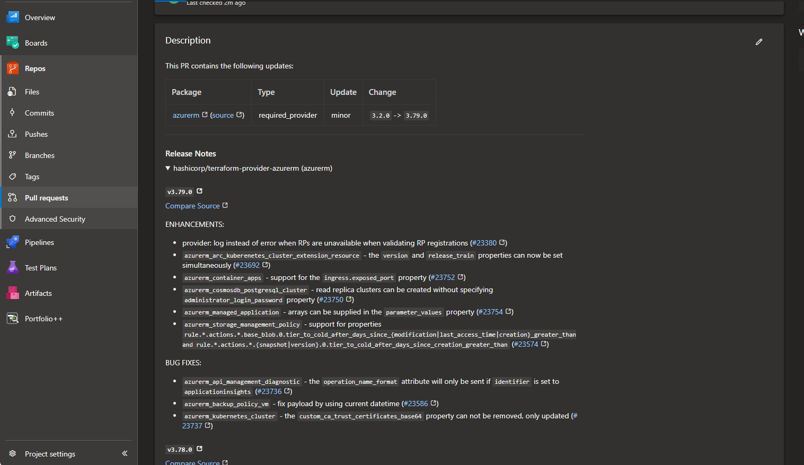

In the files section you can see that it is proposing changing the provider version
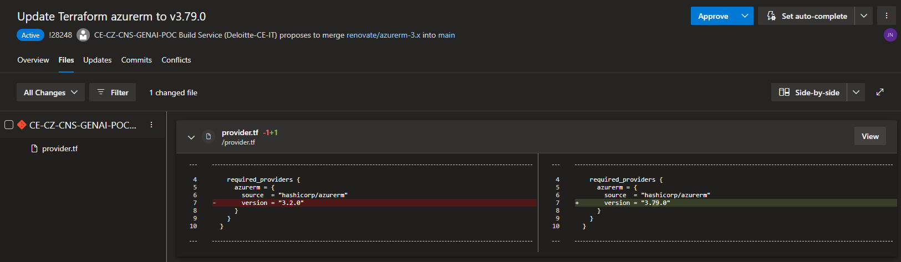

after you approve and merge the PR, your provider version will be up to date ;) this can get veryyy useful if dealing with large numbers of terraform modules

#### How to setup

The setup is fairly simple. First create the following pipeline

```YAML
schedules:
  - cron: "0 3 * * *"
    displayName: "Every day at 3am" # Adjust schedule if needed
    branches:
      include: [main]

trigger: none

pool:
  vmImage: ubuntu-latest

variables:
  - group: "renovatebot"

steps:
  - bash: |
      git config --global user.email 'bot@renovateapp.com'
      git config --global user.name 'Renovate Bot'
      npx renovate      
    env:
      TOKEN: $(System.AccessToken)
      GITHUB_COM_TOKEN: $(githubtoken) # get a token from https://github.com/settings/tokens and save it in the 'renovatebot' variables group
      RENOVATE_CONFIG_FILE: "./renovate/config.js"

```

Than create a library called "renovatebot" and put a secret there called $(githubtoken) 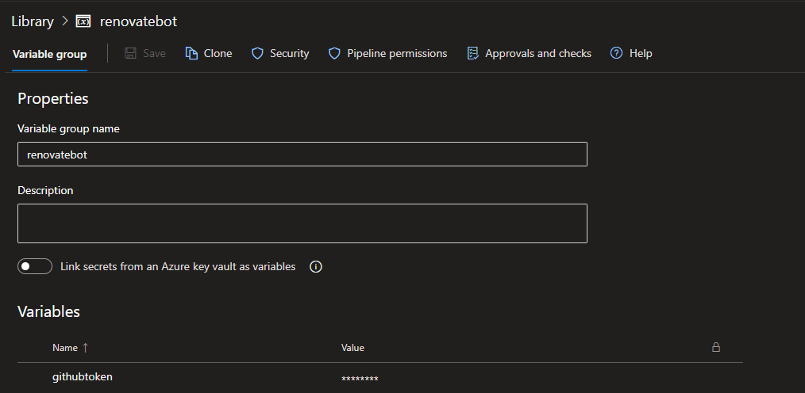 this PAT can be generated from any github account and it will work, its just to verify identity.

Next lets create a renovate config file in ./renovate/config.js it will look like this

```js
module.exports = {
    platform: 'azure',
    endpoint: 'https://dev.azure.com/Deloitte-CE-IT/',
    token: process.env.TOKEN,
    hostRules: [
        {
            "azureAutoApprove": true,
            "automerge": true
        },
    ],
    repositories: ['CE-CZ-CNS-MY-PROJECT/CE-CZ-CNS-MYREPOSITORY'], // list of repos that should be watched by renovate bot
};
```

This config defines the Azure DevOps organization, the renovate bot behaviour, but most importantly the **list of repositories it monitors** this is in the format ADO-PROJECT/REPO-NAME. If you want to monitor multiple repositories you must **specify them all here**

### terraform-docs

Another tool that is very exciting is terraform-docs. This tools automatically generates documentation for the terraform root directory and **all** of the submodules. then it will create a TFDOCS.md file for each of them, it will look something like this
<!-- BEGIN_TF_DOCS -->
**requirements**

| Name | Version |
|------|---------|
| <a name="requirement_terraform"></a> [terraform](#requirement\_terraform) | ~> 1.5 |
| <a name="requirement_azurerm"></a> [azurerm](#requirement\_azurerm) | 3.73.0 |

**providers**

| Name | Version |
|------|---------|
| <a name="provider_azurerm"></a> [azurerm](#provider\_azurerm) | 3.73.0 |

**modules**

| Name | Source | Version |
|------|--------|---------|
| <a name="module_backend-containerapp"></a> [backend-containerapp](#module\_backend-containerapp) | ./modules/container-apps | n/a |
| <a name="module_frontend-containerapp"></a> [frontend-containerapp](#module\_frontend-containerapp) | ./modules/container-apps | n/a |
| <a name="module_milvus-containerapp"></a> [milvus-containerapp](#module\_milvus-containerapp) | ./modules/container-apps | n/a |

**resources**

| Name | Type |
|------|------|
| [azurerm_cognitive_account.main](https://registry.terraform.io/providers/hashicorp/azurerm/3.73.0/docs/resources/cognitive_account) | resource |
| [azurerm_cognitive_deployment.main](https://registry.terraform.io/providers/hashicorp/azurerm/3.73.0/docs/resources/cognitive_deployment) | resource |
| [azurerm_container_app_environment.main](https://registry.terraform.io/providers/hashicorp/azurerm/3.73.0/docs/resources/container_app_environment) | resource |
| [azurerm_container_registry.acr](https://registry.terraform.io/providers/hashicorp/azurerm/3.73.0/docs/resources/container_registry) | resource |
| [azurerm_log_analytics_workspace.main](https://registry.terraform.io/providers/hashicorp/azurerm/3.73.0/docs/resources/log_analytics_workspace) | resource |
| [azurerm_postgresql_flexible_server.main_db](https://registry.terraform.io/providers/hashicorp/azurerm/3.73.0/docs/resources/postgresql_flexible_server) | resource |
| [azurerm_postgresql_flexible_server_firewall_rule.azure](https://registry.terraform.io/providers/hashicorp/azurerm/3.73.0/docs/resources/postgresql_flexible_server_firewall_rule) | resource |
| [azurerm_storage_account.main](https://registry.terraform.io/providers/hashicorp/azurerm/3.73.0/docs/resources/storage_account) | resource |
| [azurerm_storage_share.containerdocuments](https://registry.terraform.io/providers/hashicorp/azurerm/3.73.0/docs/resources/storage_share) | resource |
| [azurerm_storage_share.openai](https://registry.terraform.io/providers/hashicorp/azurerm/3.73.0/docs/resources/storage_share) | resource |
| [azurerm_resource_group.main](https://registry.terraform.io/providers/hashicorp/azurerm/3.73.0/docs/data-sources/resource_group) | data source |

**inputs**

| Name | Description | Type | Default | Required |
|------|-------------|------|---------|:--------:|
| <a name="input_backend_env_vars"></a> [backend\_env\_vars](#input\_backend\_env\_vars) | list of objects | <pre>list(object({<br>    name  = string,<br>    value = string<br>  }))</pre> | <pre>[<br>  {<br>    "name": "PG_DATABASE",<br>    "value": "postgres"<br>  },<br>  {<br>    "name": "PG_USER",<br>    "value": "dbadmin"<br>  },<br>  {<br>    "name": "PG_PASSWORD",<br>    "value": "Postgres123"<br>  }<br>]</pre> | no |
| <a name="input_environment"></a> [environment](#input\_environment) | name of the environment | `string` | n/a | yes |
| <a name="input_location"></a> [location](#input\_location) | Location of resource group | `string` | `"westeurope"` | no |
| <a name="input_milvus_etcd_env_vars"></a> [milvus\_etcd\_env\_vars](#input\_milvus\_etcd\_env\_vars) | list of objects | <pre>list(object({<br>    name  = string,<br>    value = string<br>  }))</pre> | n/a | yes |
| <a name="input_milvus_minio_env_vars"></a> [milvus\_minio\_env\_vars](#input\_milvus\_minio\_env\_vars) | list of objects | <pre>list(object({<br>    name  = string,<br>    value = string<br>  }))</pre> | n/a | yes |
| <a name="input_milvus_standalone_env_vars"></a> [milvus\_standalone\_env\_vars](#input\_milvus\_standalone\_env\_vars) | list of objects | <pre>list(object({<br>    name  = string,<br>    value = string<br>  }))</pre> | n/a | yes |
| <a name="input_postgres_pass"></a> [postgres\_pass](#input\_postgres\_pass) | pasword for postgres db | `string` | n/a | yes |
| <a name="input_postgres_user"></a> [postgres\_user](#input\_postgres\_user) | username for postgres | `string` | n/a | yes |
| <a name="input_prefix"></a> [prefix](#input\_prefix) | n/a | `any` | n/a | yes |
| <a name="input_project_name"></a> [project\_name](#input\_project\_name) | name of the project | `string` | n/a | yes |
| <a name="input_public_network_access_enabled"></a> [public\_network\_access\_enabled](#input\_public\_network\_access\_enabled) | Is public network access enabled for Postgres database | `bool` | `false` | no |

**Outputs**

| Name | Description |
|------|-------------|
| <a name="output_acr_admin_password"></a> [acr\_admin\_password](#output\_acr\_admin\_password) | n/a |
| <a name="output_acr_admin_username"></a> [acr\_admin\_username](#output\_acr\_admin\_username) | n/a |
| <a name="output_backend_url"></a> [backend\_url](#output\_backend\_url) | n/a |
| <a name="output_frontend_url"></a> [frontend\_url](#output\_frontend\_url) | n/a |
| <a name="output_id"></a> [id](#output\_id) | n/a |
<!-- END_TF_DOCS -->

This includes all the modules, resources used, but most importantly **which outputs are required and their types** so anyone can quickly see what is being passed in.

You can simply just refer the template as shown in the pipeline example and all magic is done for you. checkout the template-pipeline.yaml in tf-auto-tfdocs if you are curious how it works ;)

### checkov

This tool does SAST assesments for your terraform code and identify potencional vularabilites. It then generates a report and upload it to Azure DevOps tests view.

Example of detected findings on TF code
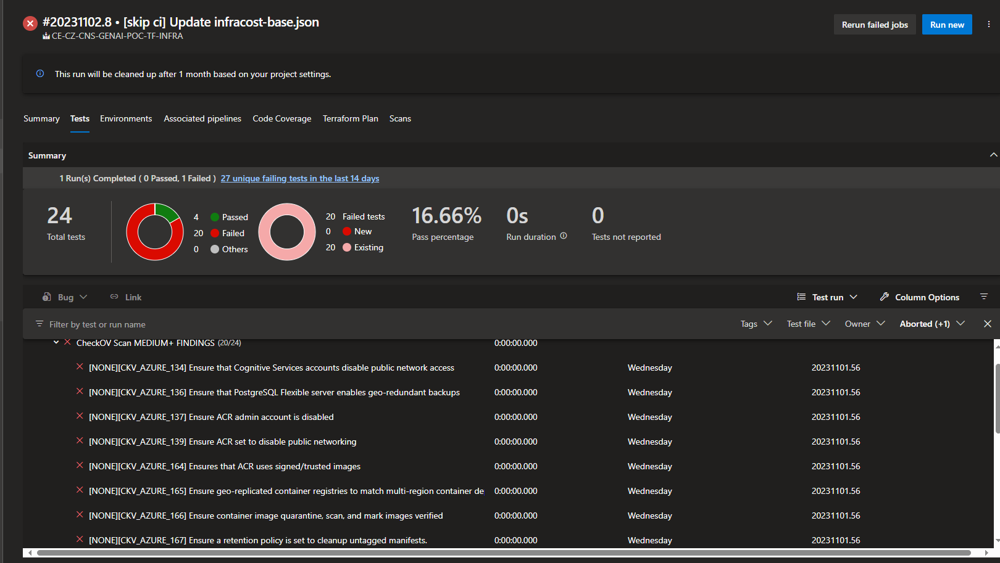

You can open any of them and it will show the description of issue and also link on how to remediate
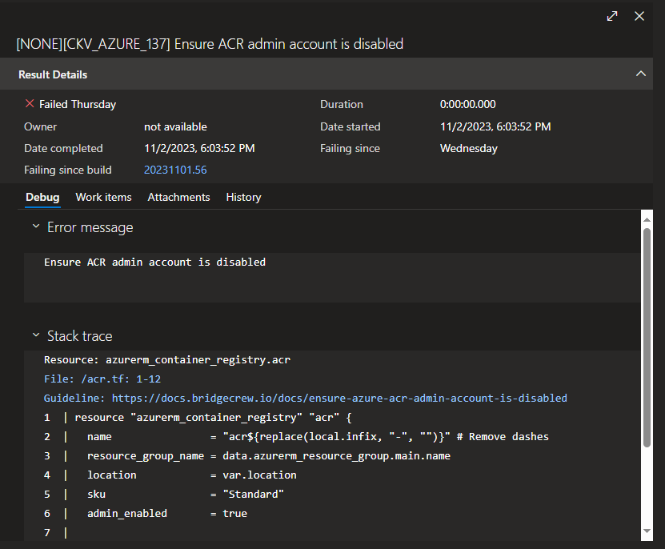

There are many advanced settings like options for surpressing some class of findings etc.

Also there is support for displaying severity of issues, but unfortunately that requires an account in bridgecrow to generate an API key <https://docs.bridgecrew.io/docs/get-api-token>, so I haven't included it in the tempate

### tf-lint

As appllication code gets linted, the terraform code as well for syntactic errors, bad formatted code etc.

Example of lint step in the pipeline
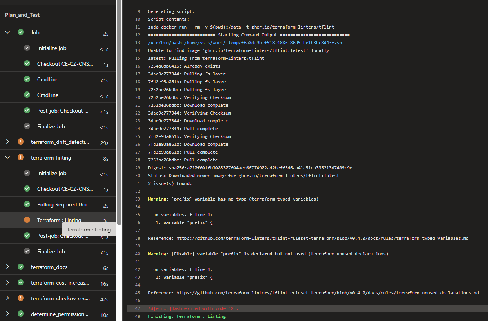

You can simply just refer the template as shown in the pipeline example and check the template-pipeline.yaml if you're curious how it works

### driftcl

driftcl is a cli tool that is run before the terraform plan step. It will scan for any drift from terraform state.

What is a drift ? let's say that you have terraform code to control your infrastructure, in this code you have a VM that has 2 cpus and 8 GB RAM, now somebody goes in and manually scales up the machine to 4 cpus and 16 GB RAM.. well we have a drift from the expected state, since this is not specified in Terraform. This tool detects such drift and notifies you about it

It will also list all resources that are not referenced in terraform. F.e manually created S3 instead via TF etc.

### infracost

infracost is a tool for cost estimations. Based on terraform code it can:

1. estimate the price for all resources
2. if you make a change in TF (f.e scale up DB) it can estimate how much will this change cost

example of n.1
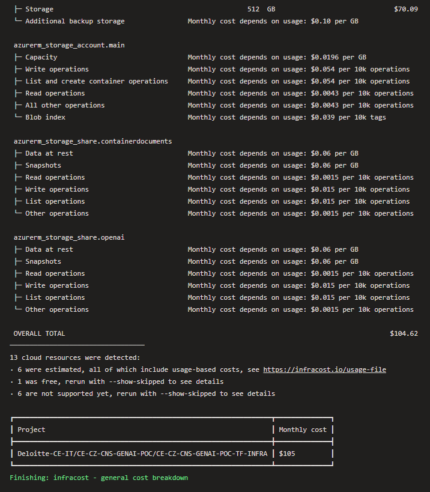

example of n.2
TODO add example

You can simply just refer the template as shown in the pipeline example and check the template-pipeline.yaml if you're curious how it works

### pike

Pike is a tool that automatically checks which permissions terraform needs to create the resources. This is useful to assign Terraform only permissions it needs without blindly giving it full admin permissions.

Please note that pike does not support **all** the resources, so check if there are some that are not supported, since you need to assess them manually  <https://github.com/JamesWoolfenden/pike/tree/master/src/mapping>. Note that this case is likely to happen for Azure and GCP sadly, but pike support for AWS is pretty good :)

Example of pike run
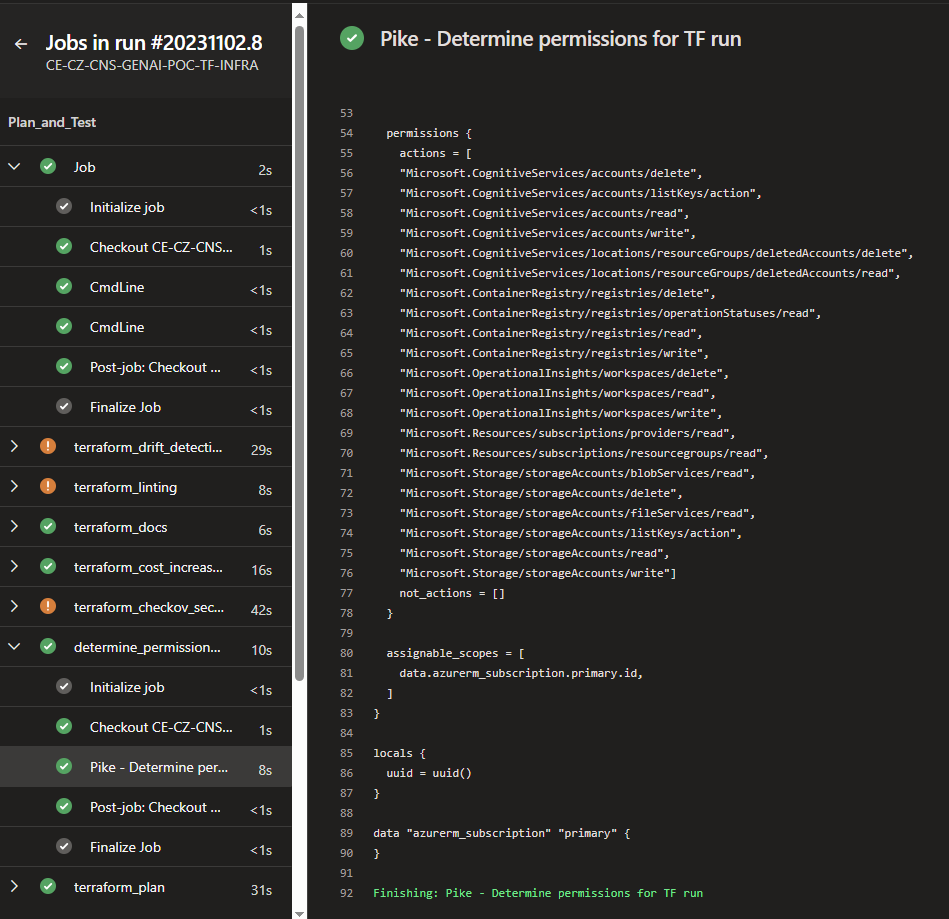

### terraform-compliance

Terraform-compliance is a tool for defining custom compliance rules that will prevent from apply or notify of breaching compliance checks

TODO add documentation

## Overall flow of the CI/CD pipeline

So now we know what are the pipeline templates and tools we use, let's check the overall flow of what is happeing in our CI/CD pipeline.

To revise, the pipeline looks like this

```YAML
## Triggers
trigger:
  branches:
    include:
    - main

pr:
  branches:
    include:
    - main

## Variables
variables:
- group: GENAI-POC-AZURE-ENV-VARS-GENERAL
- group: GENAI-POC-AZURE-LOGIN-DETAILS
- name: terraform_version
  value: 1.6.1
# Get source branch name for PRs as well as CI triggers
- ${{ if eq(variables['Build.Reason'], 'PullRequest') }}:
  - name: SOURCE_BRANCH
    value: $(System.PullRequest.SourceBranchName) 
- ${{ else }}:
  - name: SOURCE_BRANCH
    value: $(Build.SourceBranchName)

## Repository references
resources:
  repositories:
    - repository: templates-azure
      type: git
      name: CE-CZ-CNS-CLOUD-REFERENCES/ado-pipeline-templates-azure


## Stages
stages:
- stage: Plan_and_Test
  variables:
  - group: GENAI-POC-AZURE-SECRETS-PROD
  - name: ENVIRONMENT
    value: dev
  jobs:
  - job: 
    steps:
    - script: echo "IF running branch $(SOURCE_BRANCH)" 
      condition: eq(variables['SOURCE_BRANCH'], 'main')
    - script: echo "ELSE running branch $(SOURCE_BRANCH)" 
      condition: eq(variables['Build.SourceBranchName'], 'main')

  - template: tf-drift-detection/template-pipeline.yaml@templates-azure

  - template: tf-lint/template-pipeline.yaml@templates-azure

  - template: tf-auto-tfdocs/template-pipeline.yaml@templates-azure

  - template: tf-cost-estimation/template-pipeline.yaml@templates-azure

  - template: tf-security-check/template-pipeline.yaml@templates-azure

  - template: tf-determine-execution-permissions/template-pipeline.yaml@templates-azure

  - template: tf-plan/template-pipeline.yaml@templates-azure
    parameters:
      terraform_version: $(terraform_version)

- stage: Dev_Apply
  variables:
  - group: GENAI-POC-AZURE-SECRETS-PROD
  - name: ENVIRONMENT
    value: dev
  jobs:
  - template: tf-cost-estimation/template-pipeline.yaml@templates-azure

  - template: tf-drift-detection/template-pipeline.yaml@templates-azure

  - template: tf-plan/template-pipeline.yaml@templates-azure
    parameters:
      terraform_version: $(terraform_version)

  - template: tf-apply/template-pipeline.yaml@templates-azure
    parameters:
      terraform_version: $(terraform_version)
      manual_approval: false
      ado_deployment_environment_name: ${{ variables.ENVIRONMENT }}
  
- stage: Stage_Apply_Dev
  variables:
  - group: EXAMPLE-AZURE-SECRETS-DEV
  - name: ENVIRONMENT
    value: dev
  jobs:
  - template: tf-cost-estimation/template-pipeline.yaml@templates-azure

  - template: tf-drift-detection/template-pipeline.yaml@templates-azure

  - template: tf-plan/template-pipeline.yaml@templates-azure
    parameters:
      terraform_version: $(terraform_version)

  - template: tf-apply/template-pipeline.yaml@templates-azure
    parameters:
      terraform_version: $(terraform_version)
      manual_approval: false
      ado_deployment_environment_name: ${{ variables.ENVIRONMENT }}
  
- stage: Prod_Apply_Prod
  variables:
  - group: EXAMPLE-AZURE-SECRETS-PROD
  - name: ENVIRONMENT
    value: dev
  jobs:
  - template: tf-cost-estimation/template-pipeline.yaml@templates-azure

  - template: tf-drift-detection/template-pipeline.yaml@templates-azure

  - template: tf-plan/template-pipeline.yaml@templates-azure
    parameters:
      terraform_version: $(terraform_version)

  - template: tf-apply/template-pipeline.yaml@templates-azure
    parameters:
      terraform_version: $(terraform_version)
      manual_approval: false
      ado_deployment_environment_name: ${{ variables.ENVIRONMENT }}
```

Lets summarize what is happening:
**Triggers**

```YAML
## Triggers
trigger:
  branches:
    include:
    - main

pr:
  branches:
    include:
    - main
```

This section means that we are triggering the pipeline  either for new main commit or for a pr opened to main branch.

**important note** if you want to trigger pipeline on PR, you need to add the build check explicitly in azure devops UI as well in order for it to work

1. Go to settings and repositories
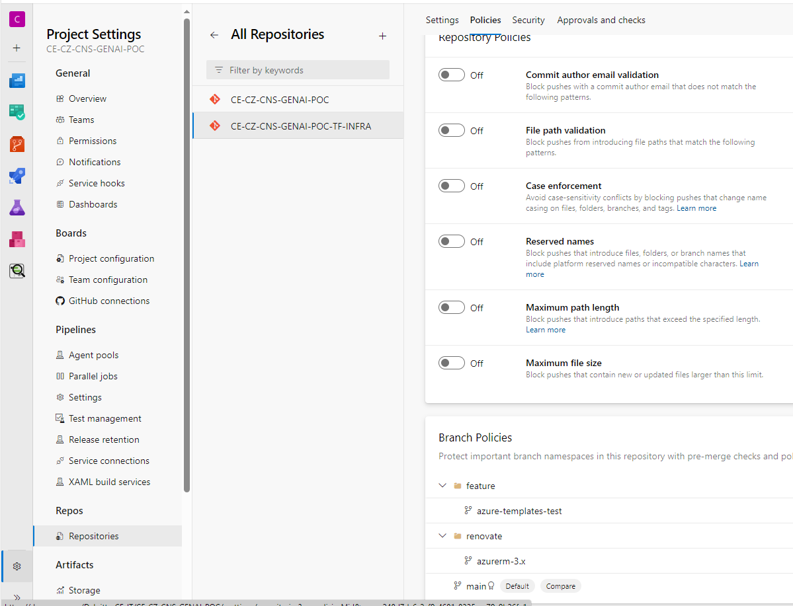
2. Click on 'main' in branch policies
3. Set the Build validation as required and select your terraform pipeline
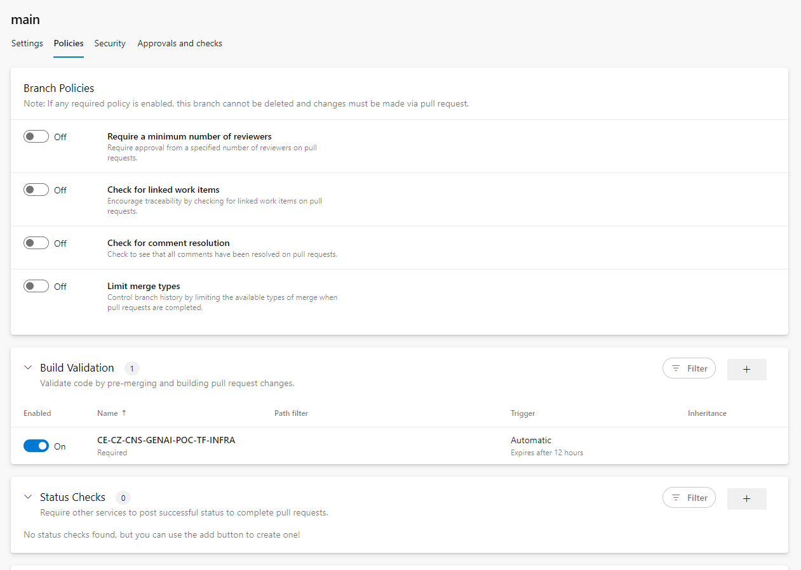

``
**Root variables**

```YAML
variables:
- group: EXAMPLE-PROJECT-AZURE-ENV-VARS-GENERAL
- group: EXAMPLE-PROJECT-AZURE-LOGIN-DETAILS
- name: terraform_version
  value: 1.6.1
# Get source branch name for PRs as well as CI triggers
- ${{ if eq(variables['Build.Reason'], 'PullRequest') }}:
  - name: SOURCE_BRANCH
    value: $(System.PullRequest.SourceBranchName) 
- ${{ else }}:
  - name: SOURCE_BRANCH
    value: $(Build.SourceBranchName)
```

This section

* imports all key-value pairs from variable groups EXAMPLE-PROJECT-AZURE-ENV-VARS-GENERAL and EXAMPLE-PROJECT-AZURE-LOGIN-DETAILS
* defines static variable terraform_Version
* defines SOURCE_BRANCH - the value depends if the pipeline was triggered by commit to main or by PR
  * if it was triggered by push to main SOURCE_BRANCH will be main
  * if it was triggered by PR SOURCE_BRANCH will be the source branch of PR (f.e feature/implement-some-new-functionality)

**repository references**

```YAML
resources:
  repositories:
    - repository: templates-azure
      type: git
      name: CE-CZ-CNS-CLOUD-REFERENCES/ado-pipeline-templates-azure
```

imports another git repository that we can use in the pipeline. This repository holds the pipeline templates

**stages**
before we get to specific jobs, you can see that we have 3 stages. Plan_and_Test, Apply_Dev and Apply_Prod on a high level these stages

1. Plan_and_Test -> run terraform plan and preview changes made
2. Apply_Dev -> deploy to dev environment
3. Apply_Prod -> deploy to prod environment

Also you can see that we are miporting secrets from variable group EXAMPLE-AZURE-SECRETS-<ENVIRONMENT> which are secrets that are only relevant on the stage scope and not globally (within dev and within prod)

### Jobs

Now lets get to the specific jobs within the stage **Plan_and_Test**

1. tf-drift-detection template
   ```- template: tf-drift-detection/template-pipeline.yaml@templates-azure```
   This job detects any drift detection, if drift is detected pipeline will fail, since tf-plan depends on this job

2. tf-lint template
   ```- template: tf-lint/template-pipeline.yaml@templates-azure```
   This job lints the TF code, pipeline will continue even if it fails. Its there just to give you a warning

3. tf-auto-tfdocs
   ```- template: tf-lint/template-pipeline.yaml@templates-azure```
   This job generates TFDOCS.md file for root tf resources and all modules. then it will commit these TFDOCS.md files back to registry

4. tf-cost-estimation
  ```- template: tf-cost-estimation/template-pipeline.yaml@templates-azure```
  This job will provide total estimation for price of the infrastructure and then diff of the price with previous state. This behaviour is different based on if we are in PR or commit to main
1. PR behaviour - diff in infrastructure cost is compared to the main branch
2. CI commit to main - diff in infrastructure cost is compared to previous commit in main

  This should never fail, but if it does the whole pipeline fails. Terraform plan depends on this task

5. tf-security-check
  ```- template: tf-security-check/template-pipeline.yaml@templates-azure```
  This runs the checkov SAST scan on terraform code and uploads the test result to pipeline run. Pipeline will continue even if this task fails, the suggestions are optional, but should be followed ;)

6. tf-determine-execution-permission
  ```- template: tf-determine-execution-permissions/template-pipeline.yaml@templates-azure```
  This runs the determination of execution permissions for terraform

7. tf-plan
  ```- template: tf-plan/template-pipeline.yaml@templates-azure```
  This template is a bit more complicated than the previous tasks and there are several things happening, so I'll go step by step.

  For reference, here is the template yaml file

  ```YAML
  parameters:
  - name: terraform_version

jobs:
  - job: "terraform_plan"
    # Drift detection and cost estimation must run before plan
    dependsOn: 
    - terraform_drift_detection
    - terraform_cost_increase_estimation
    pool:
      name: Azure Pipelines
      vmImage: 'ubuntu-latest'

    steps:
    - checkout: self
      persistCredentials: true

    - task: Bash@3
      displayName: 'Initialize Project'
      inputs:
        targetType: filePath
        filePath: '$(System.DefaultWorkingDirectory)/scripts/ensure-state-az.sh'


    - task: TerraformInstaller@0
      displayName: 'Use Terraform ${{ parameters.terraform_version }}'
      inputs:
        terraformVersion: ${{ parameters.terraform_version }}
      env:
        AWS_SECRET_ACCESS_KEY: $(AWS_SECRET_ACCESS_KEY) 

    - task: TerraformCLI@0
      displayName: 'Terraform Init'
      inputs:
        command: init
        commandOptions: '-reconfigure'
        backendType: azure
      env:
        AWS_SECRET_ACCESS_KEY: $(AWS_SECRET_ACCESS_KEY) 

    - task: TerraformCLI@0
      displayName: 'Terraform Validate'
      inputs:
        command: validate
      env:
        AWS_SECRET_ACCESS_KEY: $(AWS_SECRET_ACCESS_KEY) 

    ## If on main branch than compare with previous commit and commit back formatted code
    ## If not on main just run a check to see if code is formatted correctly
    - task: Bash@3
      condition: eq(variables['SOURCE_BRANCH'], 'main') # Triggered if source branch is main
      displayName: 'Auto formatting terraform code and commiting to main)'
      inputs:
        targetType: inline
        script: |
          terraform fmt
          git config --local user.email "terraform-fmt@myOrg.com"
          git config --local user.name "Terraform Fmt"
          git fetch --all
          git stash save "tmp"
          git checkout $(SOURCE_BRANCH)
          git pull 
          git stash pop 0
          git add *.tf
          git commit -m "[skip ci] Terraform fmt - format terraform code"
          git push
      continueOnError: true

    - task: Bash@3
      condition: not(eq(variables['SOURCE_BRANCH'], 'main')) # Triggered if source branch is not main
      displayName: 'Check if terraform code is formatted correctly (run terraform fmt to format)'
      inputs:
        targetType: inline
        script: |
          terraform fmt -check
      continueOnError: true

    - script: mkdir tfplans
      displayName: Create tfplans directory  

    - task: TerraformCLI@0
      displayName: 'terraform plan'
      inputs:
        command: plan
        publishPlanResults: 'TF Plan'
        commandOptions: '-var-file $(System.DefaultWorkingDirectory)/variables/$(ENVIRONMENT).tfvars -out=$(System.DefaultWorkingDirectory)/tfplans/terraform.tfplan -detailed-exitcode'

      env:
        AWS_SECRET_ACCESS_KEY: $(AWS_SECRET_ACCESS_KEY) 

    - task: CopyFiles@2
      displayName: 'Store Terraform plan as an artifact'
      inputs:
        contents: '$(System.DefaultWorkingDirectory)/tfplans/**'
        targetFolder: '$(Build.ArtifactStagingDirectory)'

    - publish: '$(Build.ArtifactStagingDirectory)/tfplans'
      displayName: 'Publish tfplan for later use'
      artifact: tfplans-$(System.StageDisplayName) # Artifact is unique per stage
  ```

  On a higher level it performs these steps:

  1. ensure state by running ensure-state-az.sh script [link](#scriptsensure-state-azsh)
  2. Use terraform version that is define in parameters
  3. terraform init
  4. terraform validate
  5. terraform fmt
    - the behaviour of this task differs based on if it was triggered by PR or by CI trigger. if it was by PR trigger it will use the -check flag to warn that Terraform is not properly formatted and user should use terraform fmt and push again.
    - If it was by commit on main, then it will automatically format the terraform code and push it back to the repository
  6. terraform plan
    - run terraform plan iwth specifying tfvars file and generating a terraform plan file
    - This file is then saved as an artifact, so it can be used later in the apply

Now lets get to the specific jobs within the stage **Dev_Apply**
it uses very similiar structure as Plan_and_Test but it runs only the following jobs

* tf-cost-estimation (this is because this will look different between environments, dev, stg, prod etc.)
* tf-drift-detection (again may look different bettween environments)
* tf-plan (tf-plan to show proposed changes to be applied, specific to each environment ofc. since we are supplying different env vars file for dev, prod etc.)

* **tf-apply**

```YAML
  - template: tf-apply/template-pipeline.yaml@templates-azure
    parameters:
      terraform_version: $(terraform_version)
      manual_approval: false
      ado_deployment_environment_name: ${{ variables.ENVIRONMENT }}
```

This is the only additional job that hasn't been in the previous stage.
the template looks like this

```YAML
parameters:
- name: manual_approval
  type: boolean
- name: timeout_in_minutes
  type: number
  default: 1440
- name: email_addresses_to_notify_about_approval
  default: ''
- name: terraform_version
  type: string
- name: ado_deployment_environment_name
  type: string

jobs:
  # Run this job only if parameter manual_approval is set to true
  - job: manual_approval
    condition: eq('${{ parameters.manual_approval }}', true)
    displayName: 'PLEASE CHECK THE TERRAFORM PLAN CONTAINS DESIRED RESULTS WE WANT TO APPLY'
    dependsOn: terraform_plan
    pool: server 
    timeoutInMinutes: ${{ parameters.timeout_in_minutes }} 
    steps:   
    - task: ManualValidation@0
      timeoutInMinutes: ${{ parameters.timeout_in_minutes }} 
      inputs:
        notifyUsers: |
          ${{ parameters.email_addresses_to_notify_about_approval }}
        instructions: |
          - PLEASE CHECK THE TERRAFORM PLAN CONTAINS DESIRED RESULTS WE WANT TO APPLY 
          - MAKE SURE THAT SAST, LINTING and OTHER CHECKS PASS BEFORE APPROVING
        onTimeout: 'reject'
        
  - deployment: terraform_apply
    displayName: terraform_apply
    pool:
      name: Azure Pipelines
      vmImage: 'ubuntu-latest'
    ${{ if eq('${{ parameters.manual_approval }}', true) }}:
      dependsOn:
      - manual_approval
    ${{ else }}:
      dependsOn: 
      - terraform_plan
    environment: '${{ parameters.ado_deployment_environment_name }}'
    strategy: 
      runOnce:
        deploy:
          steps:
          - checkout: self
          - task: Bash@3
            displayName: 'Initialize Project'
            inputs:
              targetType: filePath
              filePath: '$(System.DefaultWorkingDirectory)/scripts/ensure-state-az.sh'
            env:
              AWS_SECRET_ACCESS_KEY: $(AWS_SECRET_ACCESS_KEY) 


          - task: TerraformInstaller@0
            displayName: 'Use Terraform ${{ parameters.terraform_version }}'
            inputs:
              terraformVersion: ${{ parameters.terraform_version }}
            env:
              AWS_SECRET_ACCESS_KEY: $(AWS_SECRET_ACCESS_KEY) 

          - task: TerraformCLI@0
            displayName: 'Terraform Init'
            inputs:
              command: init
              commandOptions: '-reconfigure'
              backendType: azure
            env:
              AWS_SECRET_ACCESS_KEY: $(AWS_SECRET_ACCESS_KEY) 

          - task: TerraformCLI@0
            displayName: 'Terraform Validate'
            inputs:
              command: validate
            env:
              AWS_SECRET_ACCESS_KEY: $(AWS_SECRET_ACCESS_KEY)

          - task: TerraformCLI@0
            displayName: 'terraform apply'
            inputs:
              command: apply
              commandOptions: '-auto-approve $(Pipeline.Workspace)/tfplans-$(System.StageDisplayName)/terraform.tfplan'
            env:
              AWS_SECRET_ACCESS_KEY: $(AWS_SECRET_ACCESS_KEY) 
```

1. manual approval

* if this job is running or not depends on the parameter _manual_approval_ if this is set to true it will create a manual validation job
* what this means is that somebody has to manually approve this before terraform apply runs. In the paremeters you can also control which email addresses to notify, what is the timeout etc.

2. terraform_apply deployment

* uses the same tasks as plan but there is additional task for terraform apply that deploys the terraform code based on plan generated from plan

  ```YAML
    - task: TerraformCLI@0
    displayName: 'terraform apply'
    inputs:
      command: apply
      commandOptions: '-auto-approve $(Pipeline.Workspace)/tfplans-$(System.StageDisplayName)/terraform.tfplan'
    env:
      AWS_SECRET_ACCESS_KEY: $(AWS_SECRET_ACCESS_KEY) 
  ```
